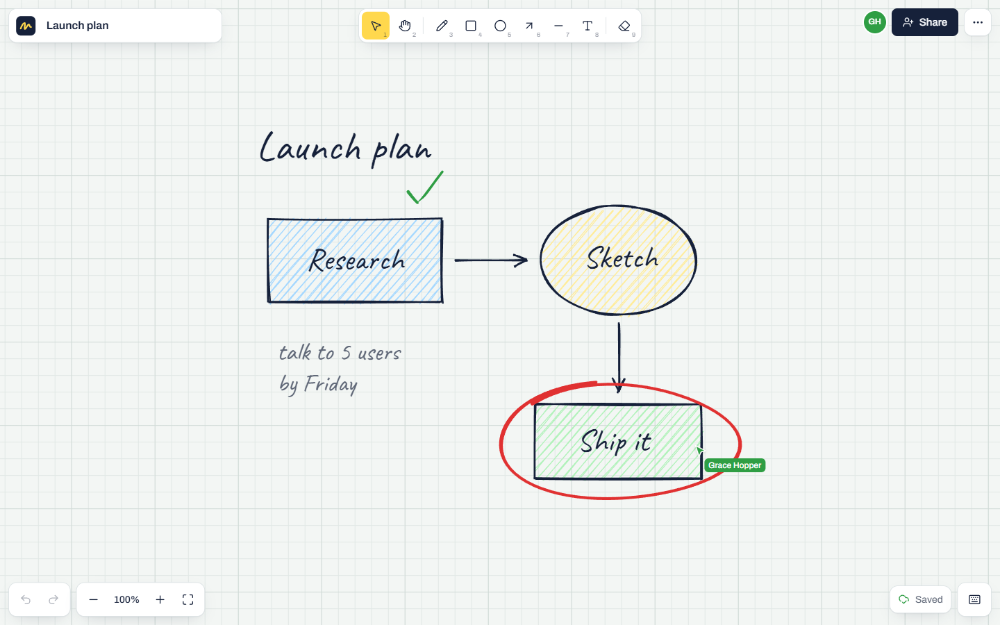
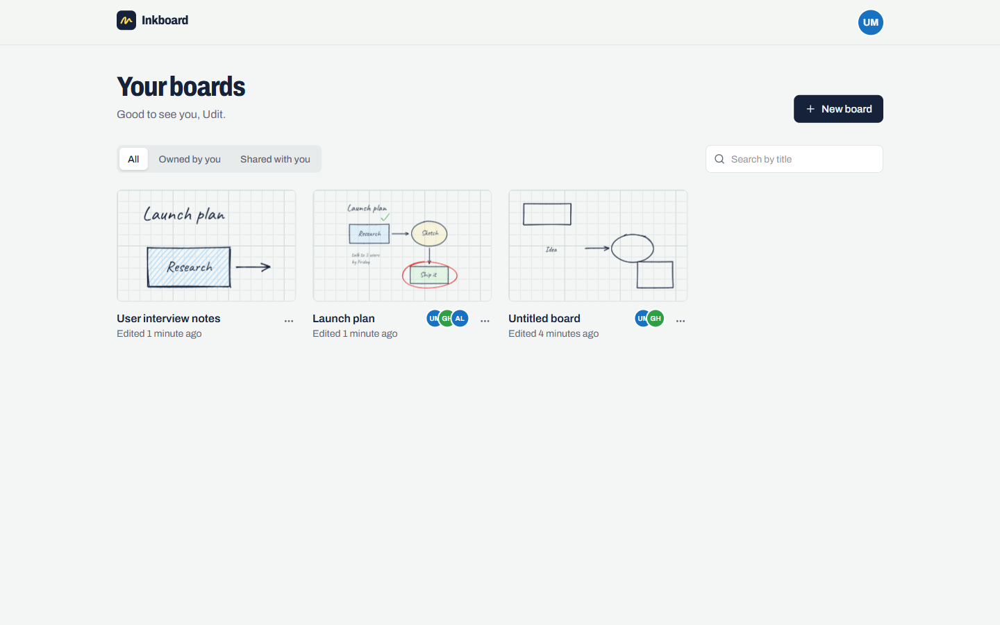
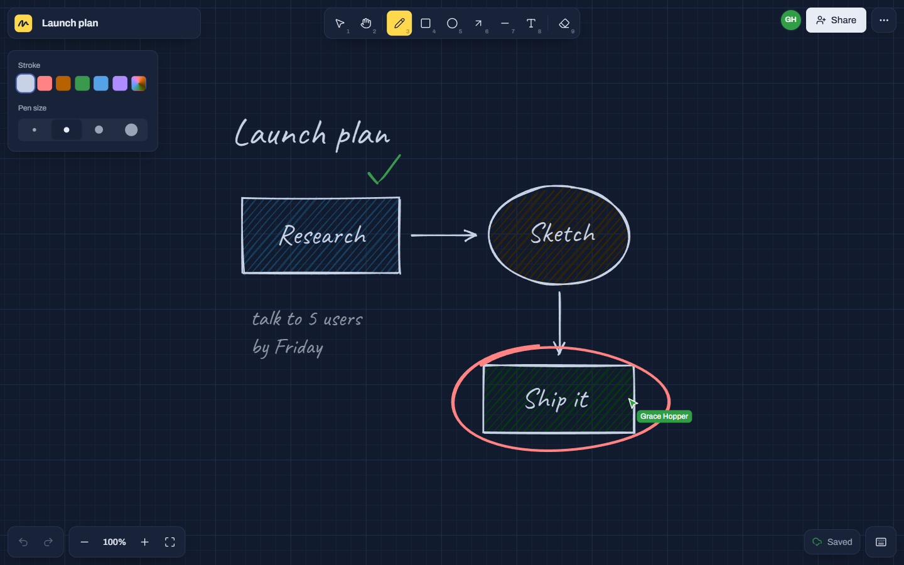

# Inkboard

A real-time collaborative whiteboard. Sketch with hand-drawn shapes, invite people by email, and watch everyone's cursors and strokes appear live.

**Live demo: [inkboard-b9k8.onrender.com](https://inkboard-b9k8.onrender.com)**



## Features

- **Live collaboration**: strokes stream to everyone on the board as they're drawn, with named cursors and a presence list.
- **Drawing tools**: pen (pressure-sensitive with a stylus), rectangle, ellipse, arrow, line, text, eraser, plus select-and-move.
- **Hand-drawn or clean**: shapes are rendered with Rough.js. Switch any of them between a sketchy and a crisp look.
- **Infinite canvas**: pan with the hand tool, space-drag or the scroll wheel. Zoom with Ctrl/⌘ + wheel, trackpad pinch or two fingers.
- **Per-person undo and redo**: undoing your own change never wipes out what collaborators drew in the meantime.
- **Sharing**: invite people by email, remove them, or leave a board. Access is checked on every request and socket event.
- **Boards dashboard**: live thumbnails, search, filters for owned and shared boards, rename and delete.
- **Works offline briefly**: edits made while disconnected are queued and synced after reconnecting.
- **Light and dark themes**: dark mode turns the graph paper into a blueprint.
- **Keyboard shortcuts** for every tool and action (press <kbd>?</kbd> on a board), and export to PNG.

| Dashboard | Dark mode |
| --- | --- |
|  |  |

## Tech stack

| Layer | Tools |
| --- | --- |
| Client | React 19, React Router, Vite, Tailwind CSS 4, Rough.js, perfect-freehand, Socket.IO client |
| Server | Node.js, Express 5, Socket.IO, Mongoose, JSON Web Tokens, bcrypt |
| Database | MongoDB (MongoDB Atlas in production) |

## How real-time sync works

Every change to a board is an **operation**: `{ upsert: Element[], remove: id[] }`. Elements are small, immutable JSON objects (a shape's corners, a stroke's points, a text's content), so the same operation can be applied identically on every client and on the server.

1. The client applies an operation locally, then batches operations every 40 ms and sends them over Socket.IO.
2. The server checks that the socket has joined that board, applies the operation to an in-memory copy, and broadcasts it to everyone else in the room.
3. Changes are written to MongoDB at most once per second, and flushed when the last person leaves or the server shuts down.

Undo history stores the inverse operation for only the elements you changed, which is why undo is safe with several people drawing at once.

## Getting started

You need [Node.js](https://nodejs.org) 20.12 or newer.

```bash
npm install
npm run dev
```

Then open http://localhost:5173.

`npm run dev` starts three processes: a local MongoDB, the API on port 5000, and the Vite dev server on port 5173. The local database needs no installation or account. It downloads MongoDB the first time it starts, which can take a few minutes, and keeps its data in `server/.data`.

To use your own database instead, such as a free MongoDB Atlas cluster, copy `server/.env.example` to `server/.env` and set `MONGODB_URI`.

### Scripts

| Command | What it does |
| --- | --- |
| `npm run dev` | Runs the local database, API and client with live reload |
| `npm run build` | Builds the client into `client/dist` |
| `npm start` | Runs the production server, which also serves the built client |

## Environment variables

Server (`server/.env`, see [`server/.env.example`](server/.env.example)):

| Variable | Required | Description |
| --- | --- | --- |
| `MONGODB_URI` | In production | MongoDB connection string |
| `JWT_SECRET` | In production | Long random string used to sign login tokens |
| `JWT_EXPIRES_IN` | No | Login lifetime, default `7d` |
| `PORT` | No | API port, default `5000` |
| `CLIENT_ORIGIN` | No | Allowed origins when the client is hosted on a different domain |

Client (`client/.env`): `VITE_API_URL` is only needed if the client and API are deployed separately.

## Deployment

The repository includes a [Render](https://render.com) Blueprint (`render.yaml`) that deploys the app as a single web service. The server hosts the API, the WebSocket connection and the built client.

1. Create a free cluster on [MongoDB Atlas](https://www.mongodb.com/atlas). Add a database user, allow access from anywhere (`0.0.0.0/0`), and copy the connection string.
2. Push this repository to GitHub.
3. In Render, choose **New → Blueprint** and select the repository.
4. Paste the Atlas connection string when asked for `MONGODB_URI`. `JWT_SECRET` is generated for you.

### Health check and keep-alive

`GET /health` returns the server and database status, with HTTP 503 if the database is unreachable. Render uses it as the service's health check.

Render's free plan puts a service to sleep after 15 minutes without traffic. The [Keep alive](.github/workflows/keep-alive.yml) GitHub Actions workflow pings `/health` every 10 minutes to prevent that. For a different deployment, set a repository variable named `HEALTH_URL`.

## Project structure

```
client/                 React app
  src/features/board/   Canvas, drawing engine, tools, sync
  src/features/landing/ Interactive demo on the home page
  src/pages/            Landing, auth, dashboard and board pages
  src/providers/        Auth, theme and socket context
server/                 Express + Socket.IO API
  src/controllers/      REST handlers for auth and boards
  src/realtime/         Socket events, live board sessions, operations
  src/models/           Mongoose schemas
render.yaml             One-click deploy configuration
.github/workflows/      Keep-alive cron for the free hosting plan
```
